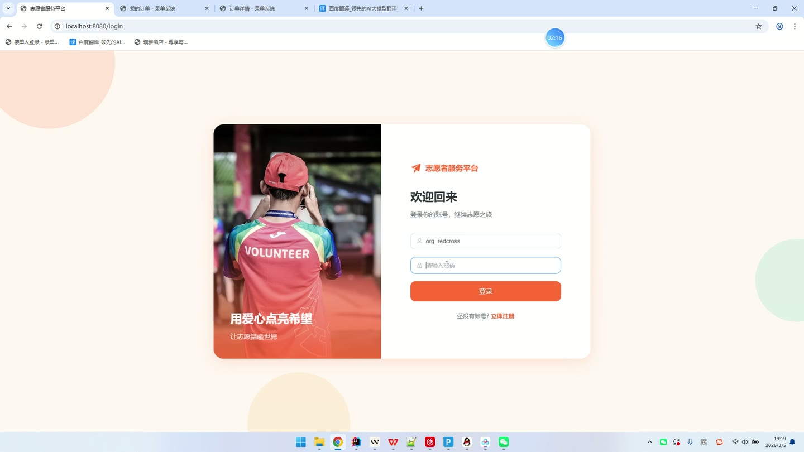
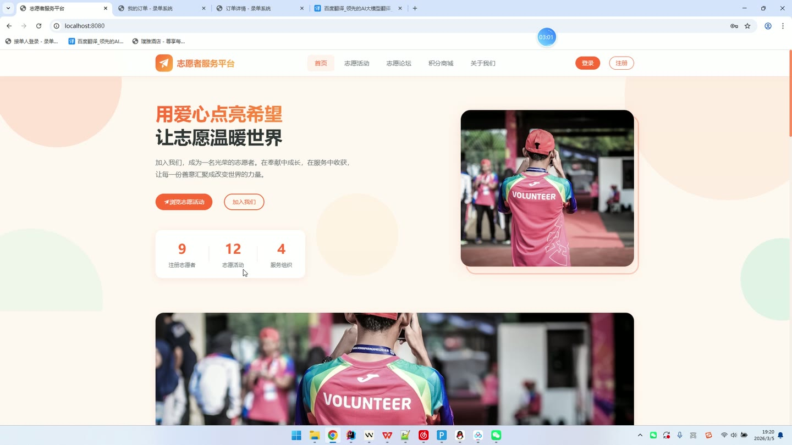
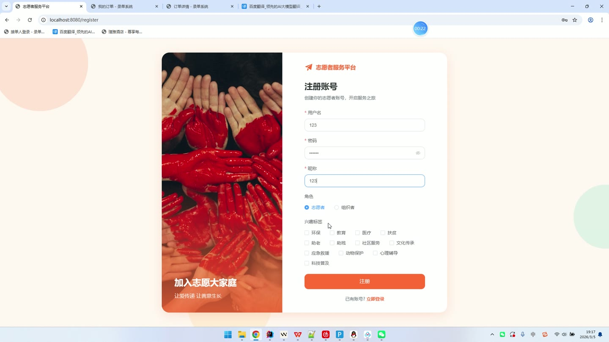
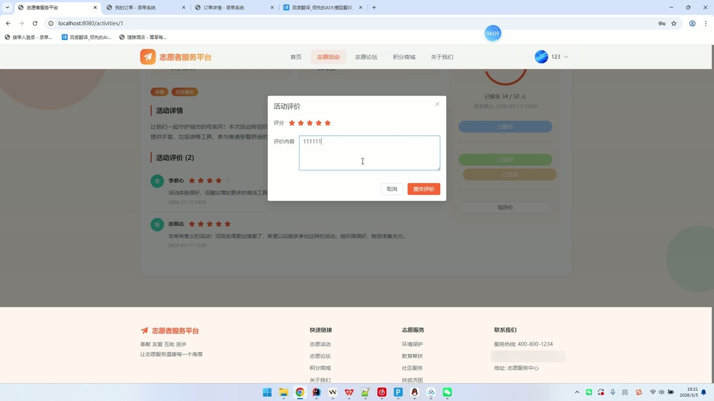
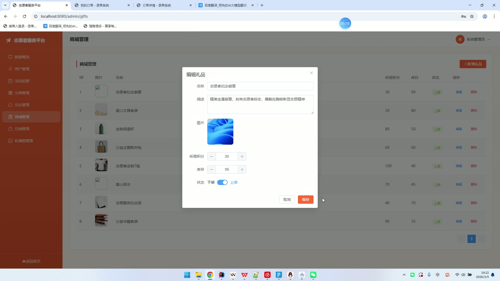
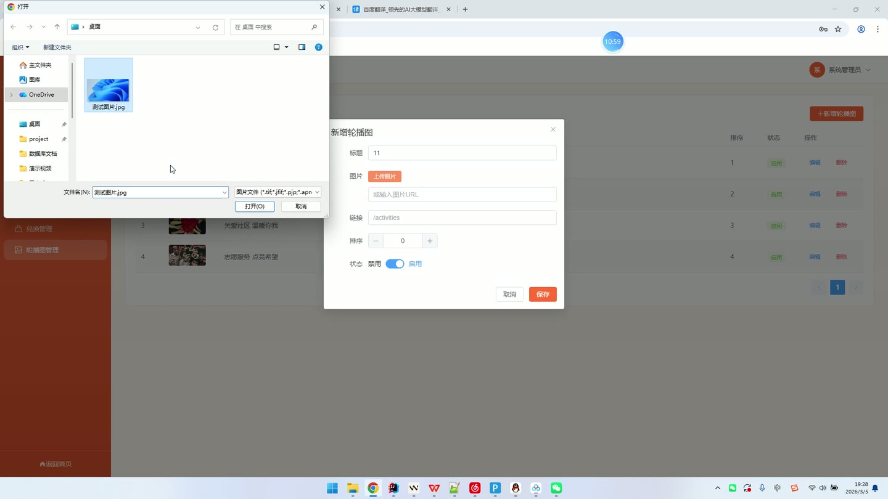

# (附文档)Springboot3+Vue3+MySQL 志愿者服务平台

**技术栈**：Springboot3、Vue3、MySQL

### 系统简介

本系统为基于 SpringBoot3 + Vue3 + MySQL 的前后端分离架构的志愿者服务平台，包含普通用户端、组织者端（管理员端）两大核心角色。平台围绕志愿活动全生命周期管理、公益积分激励、社区互动三大主线构建，涵盖活动发布与报名、签到签退与时长记录、证书发放、积分商城兑换、论坛交流等完整业务闭环。
 
### 核心功能
 
### 普通用户端

- 用户注册与登录：支持用户名密码登录，注册时可选择身份角色（志愿者/组织者），并同步选择个人兴趣标签（如环保、教育、助老等），登录后自动加载用户信息及标签列表。

- 活动浏览与筛选：查看已发布活动列表，支持按关键词标题模糊搜索、按活动分类筛选，分页展示活动封面、标题、分类名称、组织者昵称、活动时间、地点、报名人数上限及当前已报名人数。

- 活动详情查看：查看活动完整信息（封面、详细描述、地点、经纬度、开始/结束时间、报名截止时间、积分奖励、活动标签），并支持查看该活动的历史评价列表（评分+评价内容+评价人昵称头像）。

- 活动报名：对已发布活动进行报名，系统自动校验是否已报名、活动人数是否已满，报名后状态为待审核，等待组织者审核通过。

- 活动签到/签退：活动当天进行签到（记录签到时间与定位地点），活动结束后进行签退，系统自动计算服务时长（精确到0.1小时），签退后累计到个人总服务时长。

- 活动评价：对已参加的活动进行评分（1-5星）和文字评价，每个活动仅可评价一次，评价后展示在活动详情页。

- 我的活动管理：查看我的报名记录列表（含活动标题、报名状态、报名时间），可按状态（待审核/已通过/已拒绝）筛选；查看我的签到记录（含活动名称、签到时间、签退时间、服务时长）。

- 服务证书查看：查看已获得的志愿服务证书列表，展示证书编号、对应活动名称、服务时长、发证日期、证书状态。

- 论坛发帖与互动：发布论坛帖子（标题+内容+封面图），发布成功自动获得10积分；可对帖子进行点赞、评论，帖子详情页展示评论列表（评论人昵称头像、评论内容、时间）。

- 积分记录与礼品兑换：查看个人积分收支明细（获取/消费记录含说明）；浏览积分商城礼品列表（按积分值升序），使用积分兑换礼品，兑换成功后扣除对应积分、减少礼品库存，并生成兑换记录。

- 个人中心管理：修改个人资料（昵称、手机号、邮箱、头像）；修改登录密码（需验证原密码）；更新个人兴趣标签（重新选择后覆盖原标签）。

- 推荐活动：根据个人兴趣标签匹配关联活动，推荐最多6条活动；若无匹配则返回最新发布的已发布活动。
 
### 组织者端（管理员端）

- 活动管理：查看我发布的活动列表（按状态筛选），支持创建活动（填写标题、描述、封面、分类、地点、开始/结束时间、报名截止时间、人数上限、积分奖励、活动标签），支持编辑活动信息、修改活动状态（发布/完成/取消）。

- 报名审核：查看某活动下的报名列表（含志愿者昵称、手机号、报名时间、状态），支持按状态筛选，可对报名记录进行审核通过或拒绝，审核通过后自动增加活动当前报名人数。

- 签到管理：查看某活动的志愿者签到记录列表（含志愿者昵称、签到时间、签退时间、服务时长），实时掌握活动出勤情况。

- 活动数据统计：查看单个活动的报名总数、已通过人数、已签到人数、已签退人数等统计指标。

- 证书发放：对已完成签退的志愿者一键批量发放服务证书，自动生成唯一证书编号、记录服务时长和发证日期；发放证书时同步为志愿者增加活动积分并生成积分获取记录。

- 活动评价查看：查看某活动下所有志愿者的评价列表（评分、内容、评价人信息）。

- 活动分类管理：维护活动分类列表（分类名称、图标、排序），支持新增、编辑、删除分类。

- 用户管理：查看全部用户列表（按角色筛选、按用户名/昵称搜索），支持新增用户（设置用户名、密码、角色、积分、总时长）、编辑用户资料（昵称、手机、邮箱、角色、重置密码）、禁用/启用用户账号、删除用户。

- 活动总览管理：查看平台全部活动列表（按状态筛选、标题搜索），支持修改活动状态（发布/完成/取消）、删除活动。

- 论坛管理：查看全部帖子列表（按标题搜索），支持审核帖子状态（正常/屏蔽）、删除帖子（连带删除其下所有评论）。

- 礼品管理：维护积分商城礼品列表（名称、描述、图片、积分价格、库存、上下架状态），支持新增、编辑、删除礼品。

- 兑换管理：查看所有礼品兑换记录（含用户昵称、礼品名称、消耗积分、兑换时间），支持修改兑换状态（待处理/已完成/已取消）。

- 轮播图管理：维护首页轮播图列表（标题、图片、跳转链接、排序、启停状态），支持新增、编辑、删除轮播图。

- 数据看板：展示平台核心统计数据（总用户数、志愿者数、组织者数、活动总数、已发布活动数、已完成活动数、帖子总数、证书总数），并展示最近5条活动和最近5条新注册用户。
 
### 技术栈

后端框架Spring Boot 3.x
ORM框架MyBatis-Plus（含分页插件、自动填充）
权限认证Spring Security + JWT（BCrypt密码加密）
前端框架Vue 3（Vite构建）
数据库MySQL 8.x
文件上传本地磁盘存储（UUID重命名）
 
### 交付内容

- 后端完整源码

- 前端完整源码

- 数据库初始化脚本

- 万字文档

## 界面展示

---

## 获取完整源码 + 万字文档

本仓库为项目介绍页。**完整前后端源码、数据库初始化脚本、万字项目文档**，请加微信 `kangkangcode`，或访问 [codekk.top](http://codekk.top) 获取。

可作课程设计 / 毕业设计参考，支持远程部署调试。